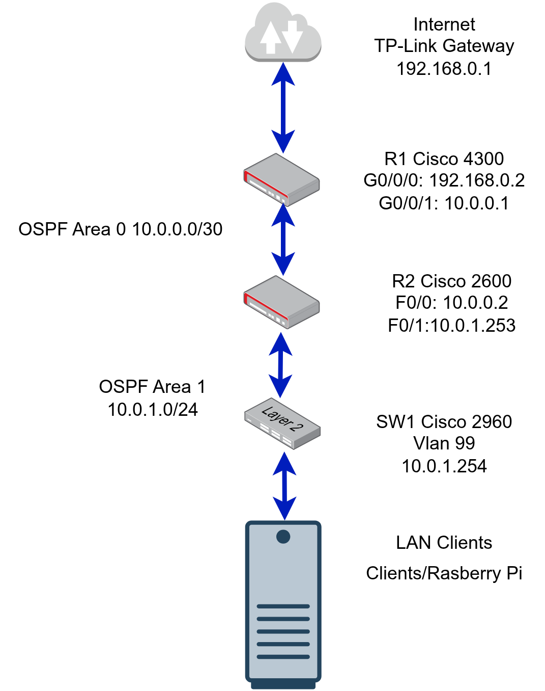

[Home](index) | [About](about) | [Skills](skills) | [Projects](projects) | [Career Goals](career-goals) | [Resume](resume) 

# Projects

# Cisco Homelab Network


A physical Cisco networking lab used to practice routing, switching, OSPF design, and network troubleshooting 
using enterprise hardware.
## Overview

This project documents the development of a personal Cisco networking lab used to practice real-world networking concepts and troubleshooting techniques.

The lab environment allows experimentation with routing, switching, VLAN segmentation, and network troubleshooting using physical Cisco hardware. It complements my formal networking studies and CCNA preparation by providing hands-on experience configuring and diagnosing network infrastructure.

---

## Lab Hardware

The current lab environment includes the following devices:

- Cisco 4300 Series Router (R1)
- Cisco 2600 Series Router (R2)
- Cisco Catalyst 2960 Switch (SW1)
- Raspberry Pi running Linux
- Laptop and PC client devices
- TP-Link bridge providing connectivity to the home network

This setup allows simulation of a small routed network with multiple segments and devices.

---

## Network Topology

The lab is currently structured as follows:

## Network Topology


This diagram shows the current logical topology of my Cisco homelab, including the edge connection to the home network, the OSPF Area 0 transit network between routers, and the LAN segment behind R2 used for client devices and experimentation.

## IP Addressing Plan (Current)

### Edge / Internet Network (192.168.0.0/24)

| Device | Interface | IP Address | Purpose |
|---|---|---:|---|
| TP-Link Gateway | — | 192.168.0.1/24 | Default gateway to Internet |
| R1 (Cisco 4300) | G0/0/0 | 192.168.0.2/24 | Outside / edge interface |

**Routing**
- R1 has a static default route pointing to **192.168.0.1**.

---

### OSPF Area 0 — Transit Network (10.0.0.0/30)

| Device | Interface | IP Address | Role |
|---|---|---:|---|
| R1 (Cisco 4300) | G0/0/1 | 10.0.0.1/30 | Area 0 backbone |
| R2 (Cisco 2600) | F0/0 | 10.0.0.2/30 | Area 0 backbone |

**Purpose**
- Router adjacency and backbone transit between R1 and R2.

---

### OSPF Area 1 — LAN Network (10.0.1.0/24)

| Device | Interface | IP Address | Notes |
|---|---|---:|---|
| R2 (Cisco 2600) | F0/1 | 10.0.1.253/24 | LAN default gateway |
| SW1 (Cisco 2960) | VLAN 99 | 10.0.1.254/24 | Switch management SVI |

**OSPF Note**
- The LAN interface on R2 is advertised into OSPF but set as **passive** (no neighbor formation on the LAN).

---

### Loopbacks (Router IDs)

| Device | Interface | IP Address | Purpose |
|---|---|---:|---|
| R1 | Loopback0 | 1.1.1.1/32 | OSPF Router ID |
| R2 | Loopback0 | 2.2.2.2/32 | OSPF Router ID |

---

## OSPF Design Summary

| Area | Network | Devices |
|---|---|---|
| Area 0 | 10.0.0.0/30 | R1 ↔ R2 (transit) |
| Area 1 | 10.0.1.0/24 | LAN behind R2 |

- **R2 functions as the ABR** (Area Border Router).
- R2 learns **0.0.0.0/0** via OSPF from R1.

---

## Topology Diagram (Logical)

```
              Internet
                 |
       TP-Link Gateway (192.168.0.1/24)
                 |
        R1 G0/0/0 (192.168.0.2/24)
                 |
    OSPF Area 0: 10.0.0.0/30 (Transit)
       R1 G0/0/1 (10.0.0.1) ---- R2 F0/0 (10.0.0.2)
                 |
            R2 (ABR)
            R2 F0/1 (10.0.1.253/24)
                 |
    OSPF Area 1: 10.0.1.0/24 (LAN)
                 |
     SW1 VLAN 99 SVI (10.0.1.254/24)
                 |
   Clients PC/Laptops/RaspberryPi
```
       
## Purpose of the Lab

This environment is used to practice and document core networking concepts including:

- VLAN segmentation
- Routing between networks
- OSPF routing protocol configuration
- Network troubleshooting techniques
- Infrastructure documentation

Future updates to this project will include configuration examples, troubleshooting scenarios, and verification outputs from the lab environment.

## ICT Capstone Project (Starting)
This portfolio will include reflections on project management, teamwork, technology use, culture awareness, and professional ethics as the project progresses.
